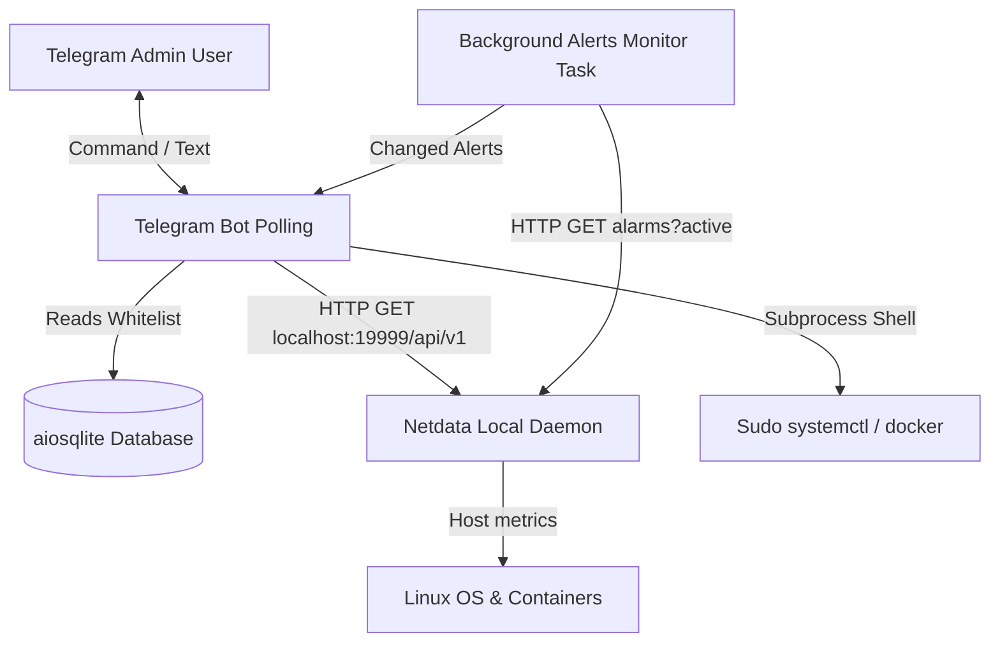

# Project Architecture - Hetzner Server Manager

This document describes the design, directory structure, operational mechanisms, and security model of the Hetzner Server Manager repository.

---

## 🗺️ Directory Layout

The workspace is organized as follows:

```
hetzner-manager/
├── BOT_HANDOVER.md          # Onboarding / context handover document for AI agents
├── deploy.sh                # Main IaC deployment script from local laptop to VPS
├── bot/                     # Core Telegram Monitoring Bot codebase
│   ├── requirements.txt     # Python dependencies for the bot
│   ├── .env.example         # Environment template (secrets, IDs, tokens)
│   ├── data/                # Bot state directory (persistent SQLite database)
│   │   └── bot_state.db     # Active SQLite DB mapping Telegram accounts to admins
│   └── src/                 # Python source files
│       ├── main.py          # Entrypoint: sets up db, commands, middleware, and starts polling
│       ├── database/
│       │   └── db.py        # Database manager (schema initialization, user query interfaces)
│       └── bot/
│           ├── alerts.py    # Background task polling Netdata alarms and sending alerts
│           ├── handlers/
│           │   ├── __init__.py
│           │   ├── base.py  # Bot commands (/sysinfo, /daemons, /restart_daemon, /docker, etc.)
│           │   └── message.py # Shell command handler (intercepts '$ <cmd>' messages)
│           └── middleware/
│               └── auth.py  # User whitelisting middleware filtering all incoming events
├── configs/                 # Host system configuration templates
│   ├── netdata.conf         # Main Netdata configuration (optimized CPU/RAM footprint)
│   ├── docker.conf          # Netdata docker daemon interface connector config
│   ├── msmtprc              # System-wide SMTP configuration for Gmail App Passwords
│   └── health_alarm_notify.conf # Recipients configuration for Netdata default alerting
├── scripts/                 # Administration and health diagnostics scripts
│   ├── configure_ufw.sh     # Firewall script restricting Netdata port 19999 to Tailscale VPN
│   ├── install_netdata.sh   # Automated Netdata kickstart shell script
│   ├── server_status.py     # Local laptop CLI status viewer pulling VPS Netdata metrics
│   ├── setup_alerts.sh      # Interactive VPS alert configuration script (SMTP)
│   └── weekly_report.py     # Weekly cron script aggregating load stats and emailing report
└── notes/                   # Project backlog, logs, and guides
    ├── backlog.md           # Roadmap and sprint progress tracker
    ├── monitoring_guide.md  # Detailed admin manual for Netdata VPN, alerts, and cron reports
    ├── project_architecture.md # [This file] Developer guide explaining code layout & flows
    └── work_log.md          # Chronological lab/work session logs
```

---

## ⚙️ Core Architecture & Metrics Flow



### 1. System Metrics & `/sysinfo` Command
Instead of using generic shell commands, the bot integrates directly with the Netdata daemon running locally on the VPS (`http://localhost:19999/api/v1`).
* **OS & Uptime**: Fetched from the `/api/v1/info` endpoint.
* **Load Average**: Fetched from the `system.load` chart.
* **CPU Usage**: Extracted by summing active dimensions in the `system.cpu` chart.
* **RAM Usage**: Extracted from the `system.ram` chart (calculates used vs total).
* **Disk Usage**: Extracted from the `disk_space./` chart.

### 2. Real-Time Alert Dispatching
The bot runs a concurrent background task ([alerts.py](file:///home/ging/prog/hetzner-manager/bot/src/bot/alerts.py)) alongside `aiogram`'s polling.
* Every 30 seconds, it queries `/api/v1/alarms?active`.
* It compares active alarms against an in-memory cache.
* When a new `WARNING` or `CRITICAL` alert arises, it sends a Markdown-formatted warning message to all whitelisted admins.
* When an active alert disappears from the list, it dispatches a resolved (`🟢`) message.

---

## 🔒 Security Model & Host Permissions

To protect the host system from unauthorized access and privilege escalation:
1. **User Demotion**: The bot's systemd service (`hetzner-bot.service`) runs as `tg-monitor`, a dedicated system user with no shell access.
2. **Access Whitelist**: The bot rejects all incoming messages unless the user's Telegram ID is whitelisted in `data/bot_state.db`. If someone attempts to access the bot, the event is silently dropped, and a security warning is logged.
3. **Limited Sudo Execution**: The user `tg-monitor` belongs to the `docker` group (to poll docker states and run `docker restart`). It is granted passwordless `sudo` execution **exclusively** for restarting these system services:
   ```sudoers
   tg-monitor ALL=(ALL) NOPASSWD: /usr/bin/systemctl restart ag2r.service, /usr/bin/systemctl restart antigravity-gui.service, /usr/bin/systemctl restart xvfb.service, /usr/bin/systemctl restart hetzner-bot.service
   ```
4. **Shell execution (`$ <cmd>`)**: Admin users can run generic shell commands through the bot. These execute under the restricted `tg-monitor` user privilege, limiting impact.

---

## 🚀 Deployment Cycle (IaC)

Deployment utilizes a local-first single source of truth model:
1. All changes are written locally on the laptop.
2. Running [deploy.sh](file:///home/ging/prog/hetzner-manager/deploy.sh) connects to the VPS via SSH/rsync.
3. The script:
   * Syncs bot code and system configs to `/opt/hetzner-manager`.
   * Sets up python venv and updates `requirements.txt` dependencies.
   * Modifies permissions and owners (e.g. `chown -R tg-monitor:tg-monitor`).
   * Configures the systemd unit file and registers passwordless sudo rules.
   * Reloads systemd and restarts `hetzner-bot.service`.
